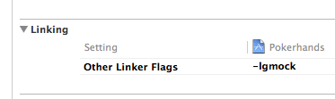

StudyCppUTest
=============

Study CppUTest, gtest and gmock in Mac.

Use the make to build the gmock in Mac.

###Build the gtest libray with XCode
  
It is said in README of the gtest source tree as below

```
As an example, the make/ directory contains a Makefile that you can use to build Google Test on systems where GNU make is available (e.g. Linux, Mac OS X, and Cygwin). It doesn't try to build Google Test's own tests. Instead, it just builds the Google Test library and a sample test. You can use it as a starting point for your own build script.

If the default settings are correct for your environment, the following commands should succeed:

cd ${GTEST_DIR}/make make ./sample1_unittest

If you see errors, try to tweak the contents of make/Makefile to make them go away. There are instructions in make/Makefile on how to do it.
```

I refer to the more detailed instructions from [google test with Xcode in mac os x](http://dennycd.me/google-test-xcode-mac-osx).

- Go to the make/ directory under gtest’s source tree and make two static lib

```
make gtest.a gtest_main.a
```

- In order to support the libc++ library in Xcode (with C++11 support), you need to go to gtest’s make/ directory and modify the Makefile by adding the following to CXXFLAGS

```
CXXFLAGS += -g -Wall -Wextra -stdlib=libc++ -std=c++11
```
- You can also build the samples to verify your build.

```
make sample1_unittest
./sample1_unittest
```

**One tip**: If you want to use the Other Linker Flags to link to gmock as below, you need to make sure the library's name is libgmock.a.

  

###Build the gtest with CMake
Make a directory under gtest-1.7.0. The last variable ".." points to the gtest directory.

```
mkdir build
cd build
cmake -Dgtest_build_samples=ON -DCMAKE_CXX_COMPILER="clang++" -DCMAKE_CXX_FLAGS="-std=c++11 -stdlib=libc++" ..
```

### Related documents
- [Google C++ Testing Framework Wiki](https://code.google.com/p/googletest/w/list)
- [Google C++ Mocking Framework Wiki](https://code.google.com/p/googlemock/w/list)  

Especially the CookBook, it is very informative.

###Using Mock in Tests
It is from [Google C++ Mocking Framework for Dummies](https://code.google.com/p/googlemock/wiki/V1_7_ForDummies#Using_Mocks_in_Tests) 

1. Import the Google Mock names from the testing namespace such that you can use them unqualified (You only have to do it once per file. Remember that namespaces are a good idea and good for your health.).
2. Create some mock objects.
3. Specify your expectations on them (How many times will a method be called? With what arguments? What should it do? etc.).
4. Exercise some code that uses the mocks; optionally, check the result using Google Test assertions. If a mock method is called more than expected or with wrong arguments, you'll get an error immediately.
5. When a mock is destructed, Google Mock will automatically check whether all expectations on it have been satisfied.


