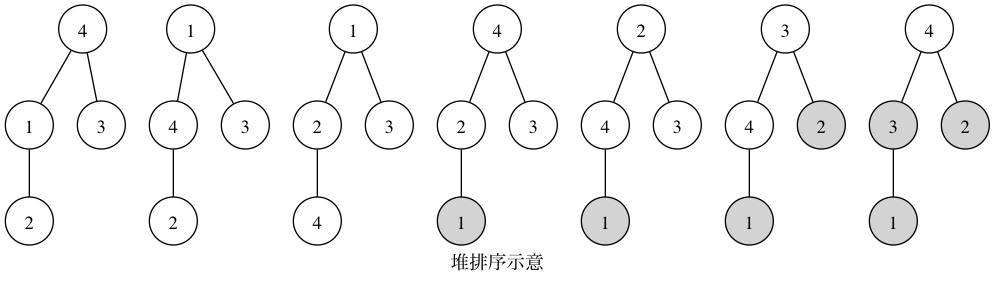
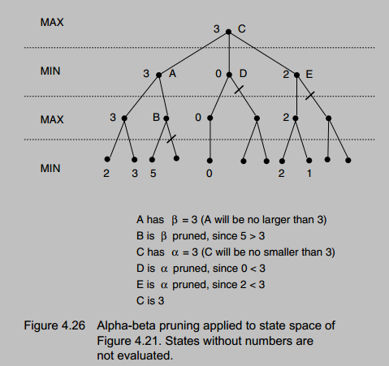

算法
===

###JDOJ1348: 数组中的逆序对
问题的要点是将时间复杂度控制在$nlogn$，而不是$n^2$。解题思路参考归并排序。  
另外两组排好序的数组如何来计算逆序对？  
$$a_0,a_1,…,a_n$$   
$$b_0,b_1,…,b_m$$   
假设$a_i>b_j$，那么$a_i$及$a_i$以后的元素都与$b_j$形成逆序对，逆序对的个数为$n-i+1$。

```{.cpp .numberLines}
    void merge(int a[], int low, int high, int t[])
    {
        int mid = (low + high)/2;
        int i=low;
        int j=mid;
        int k=low;
        while (i < mid && j< high) {
            if (a[i] <= a[j])
                t[k++] = a[i++];
            else {
                t[k++] = a[j++];
                //a[j]与{a[i],...,a[mid-1]}的所有元素都构成逆序数
                reverseOrder += mid-i;
            }
        }
        
        while (i<mid)
            t[k++] = a[i++];
        
        while (j<high)
            t[k++] = a[j++];
        
        for (i=low; i<high; i++)
            a[i] = t[i];
    }
    
    void mergesort(int a[], int low, int high, int t[])
    {
        if (high - low > 1) // If the array contains two more elements
        {
            int mid = (low + high)/2;
            mergesort(a, low, mid, t);
            mergesort(a, mid, high, t);
            merge(a, low, high, t);
        }
    }
```

###JDOJ1354: 和为S的连续正数序列
此题和题目 **JDOJ1352: 和为S的两个数字** 有点类似，使用头尾两个指针遍历一遍数组，属于脑筋急转弯一类的题目。

```{.cpp .numberLines}
    void calc(int s)
    {
        bool bExist=false;
        int i = 1; //low index
        int j = 2; //high index
        int sum = 3;
       
        while (i < j) {
            if (sum < s)
                sum += ++j;
            else if(sum > s)
                sum -= i++;
            else{
                bExist = true;
                for (int k=i; k<j; k++)
                    printf("%d ", k);
                printf("%d\n", j);
                sum -= i++;
            }
        }
        
        if (!bExist)
            printf("Pity!\n");
        
        printf("#\n");
    }
```

###JDOJ1369: 字符串的排列
棘手的是处理重复的字符。基本思路是**保持重复字符的原有顺序**。比如AAB，将重复的字符A不妨分别标记为$A_0$, $A_1$，这个字符串标记为$A_0A_1$B。排列中可以出现$A_0$B$A_1$，但不可以出现$A_1$B$A_0$。如果$A_0$没有出现，那么$A_1$也不应该出现，这样避免输出重复的排列。

```{.cpp .numberLines}
    void permutation(char s[], char t[], bool used[], int len, int index)
    {
        if (len == index) {
            printf("%s\n", t);

            return;
        }
        
        for (int i=0; i<len; i++) {
            if (used[i])
                continue;
            
            if (i>0 && s[i]==s[i-1] && !used[i-1])
                continue;
            
            t[index] = s[i];
            ++index;
            used[i] = true;
            permutation(s, t, used, len, index);
            used[i] = false;
            --index;
        }
    }
```

###JDOJ1371: 最小的K个数
以小顶堆来示意堆排序的过程如下，原始数组为{4, 1, 3, 2}，最终的排序结果为{4, 3, 2, 1}


####堆排序思想：
先建一个“小顶堆”，得到一个关键字最小的记录，然后与序列中最后一个记录交换，之后继续对序列中前 n-1 记录进行“筛选”，重新将它调整为一个“小顶堆”。再将堆顶记录和第 n-1 个记录交换，如此反复直至排序结束。所谓“筛选”指的是对一棵左/右子树均为堆的完全二叉树，“调整”根结点使整个二叉树为堆。
``` {.cpp .numberLines}
    void adjustSmallHeap(int a[], int heapLength, int i)
    {
        int l = 2*i+1;
        int r = l+1;
        
        int smallest = i;
        if (l<heapLength && a[l]<a[i])
            smallest = l;
        
        if (r<heapLength && a[r]<a[smallest])
            smallest = r;
        
        if (smallest != i) {
            int temp = a[i];
            a[i] = a[smallest];
            a[smallest] = temp;
            
            adjustSmallHeap(a, heapLength, smallest);
        }
    }
    
    // Get the least k numbers
    void heapSort(int a[], int length, int k)
    {
        // Setup a heap
        for (int i=length/2-1; i>=0; --i)
            adjustSmallHeap(a, length, i);
        
        for (int i=length-1; i>0 && i>=length-k; --i) {
            int temp = a[i];
            a[i] = a[0];
            a[0] = temp;
            
            adjustSmallHeap(a, i, 0);
        }
    }
```

###HDOJ1003: Max Sum

$b_i$表示以$a_i$元素结尾的最大子段和，则所求的最大子段为$max\{b_i\}, 0 \leq i < n$。

``` {.cpp .numberLines}
b[0]=a[0];
for (int i=1; i<len; i++)
    if (b[i-1] < 0)
        b[i] = a[i];
    else
        b[i] = b[i-1] + a[i];
```

###POJ1568: Find the Winning Move

- [井字棋](http://en.wikipedia.org/wiki/Tic-tac-toe)
- [吴昊品游戏核心算法](http://www.cnblogs.com/tuanzang/archive/2013/02/28/2936714.html)
- [对弈程序基本技术](http://www.xqbase.com/computer/outline.htm)

**[Alpha–beta pruning](http://en.wikipedia.org/wiki/Alpha-beta_pruning)** is a search algorithm that seeks to decrease the number of nodes that are evaluated by the **minimax algorithm** in its search tree. It is an adversarial search algorithm used commonly for machine playing of two-player games (**Tic-tac-toe**, Chess, Go, etc.). It stops completely evaluating a move when at least one possibility has been found that proves the move to be worse than a previously examined move. Such moves need not be evaluated further. When applied to a standard minimax tree, it returns the same move as minimax would, but prunes away branches that cannot possibly influence the final decision.



基本算法如下：
```{.c .numberLines}
function alphabeta(node, depth, α, β, Player)         
    if  depth = 0 or node is a terminal node
        return the heuristic value of node
    if  Player = MaxPlayer // 极大节点
        for each child of node
            α := max(α, alphabeta(child, depth-1, α, β, not(Player) ))
            // 该极大节点的值>=α>=β，该极大节点后面的搜索到的值肯定会大于β，
            // 因此不会被其上层的极小节点所选用了。对于根节点，β为正无穷  
            if β ≤ α // Beta cut-off
                break  
        return α
    else // 极小节点
        for each child of node
            β := min(β, alphabeta(child, depth-1, α, β, not(Player) ))
            // 该极大节点的值<=β<=α，该极小节点后面的搜索到的值肯定会小于α，
            // 因此不会被其上层的极大节点所选用了。对于根节点，α为负无穷
            if β ≤ α // Alpha cut-off
                break  
        return β 
// Initial call
alphabeta(origin, depth, -infinity, +infinity, MaxPlayer)
```
代码如下所示：
``` {.cpp .numberLines}
    int Game::minimax(int type, int x, int y, int alpha, int beta)
    {
        //Check whether the game is over
        if (over(x, y)) // Game is over
            return type==1? -INF:INF;
        
        if (chess == 16) // No winner
            return 0;
        
        if (type) { // MAX Node
            for (int i=0; i<4; i++) {
                for (int j=0; j<4; j++) {
                    if (board[i][j] == '.') {
                        board[i][j] = 'x';
                        ++chess;
                        int score = minimax(0, i, j, alpha, beta);
                        board[i][j] = '.';
                        --chess;
                        
                        if (score > alpha)
                            alpha = score;
                        if (alpha >= beta)
                            return alpha;
                    }
                }
            }
            
            return alpha;
        }
        else{ // MIN Node
            for (int i=0; i<4; i++) {
                for (int j=0; j<4; j++) {
                    if (board[i][j] == '.') {
                        board[i][j] = 'o';
                        ++chess;
                        int score = minimax(1, i, j, alpha, beta);
                        board[i][j] = '.';
                        --chess;
                        
                        if (score < beta)
                            beta = score;
                        if (alpha >= beta)
                            return beta;
                    }
                }
            }
            return beta;
        }
    }
```

